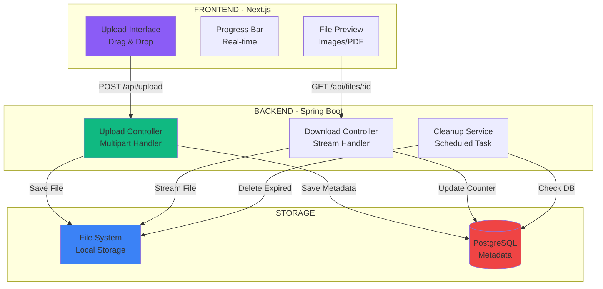
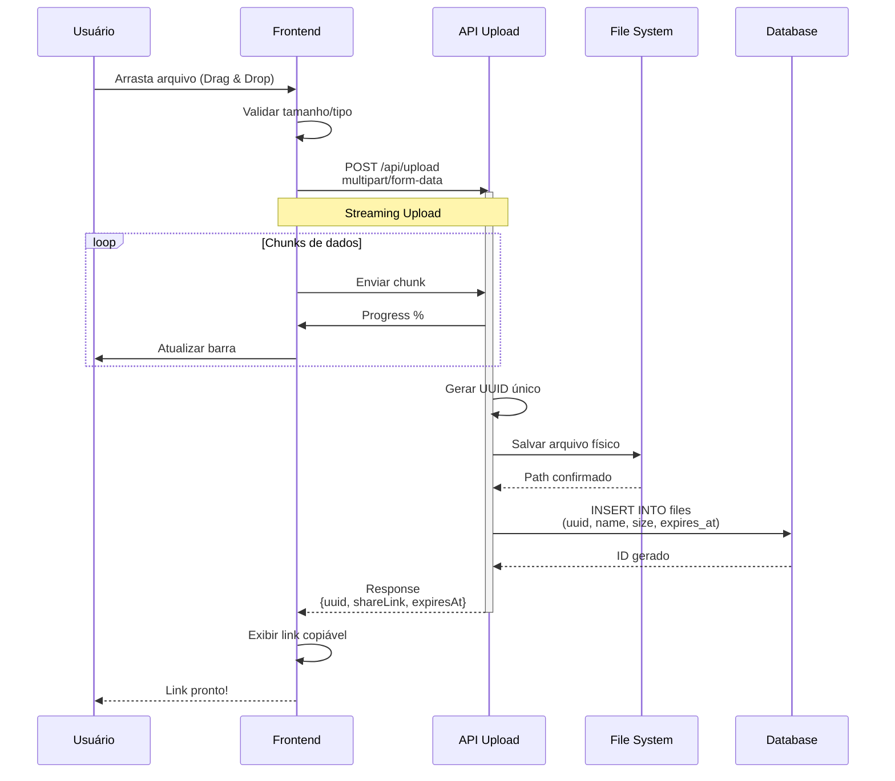
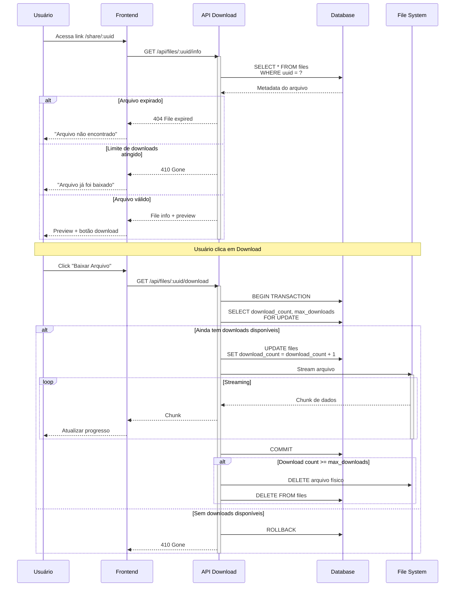
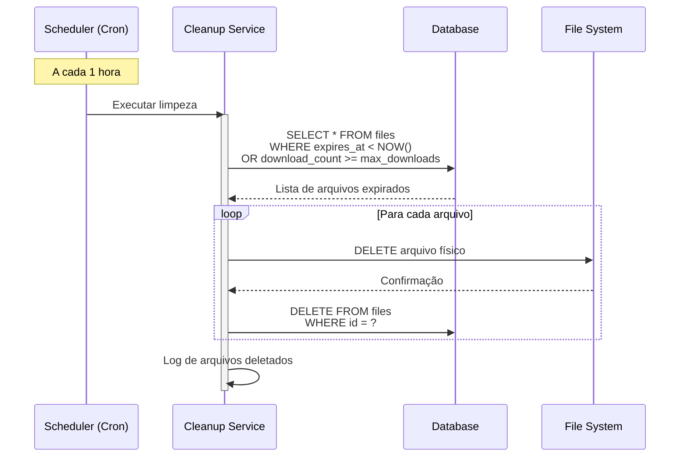
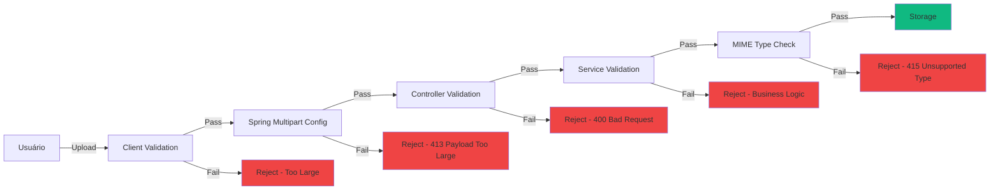

# 📦 ShareDrop V1 - WeTransfer Clone

## 🎯 Visão Geral do Projeto

**ShareDrop** é um serviço de compartilhamento temporário de arquivos que permite upload de documentos, imagens e outros tipos de arquivos, gerando links únicos para compartilhamento. Os arquivos são automaticamente deletados após um número definido de downloads ou tempo de expiração.

### Objetivos da V1 (MVP)
- ✅ Upload de arquivos (até 100MB)
- ✅ Geração de link único e seguro
- ✅ Download com contador de acessos
- ✅ Deleção automática por tempo (24h, 7 dias)
- ✅ Deleção automática por limite de downloads
- ✅ Interface drag-and-drop moderna
- ✅ Barra de progresso de upload/download
- ✅ Preview de imagens e PDFs
- ✅ Sem necessidade de login/autenticação

---

## 🏗️ Arquitetura do Sistema

### Visão Macro



### Fluxo de Upload Completo



### Fluxo de Download com Contadores



### Fluxo de Limpeza Automática (Cleanup)



---

## 🗄️ Modelo de Dados

### Tabela: `files`

```sql
CREATE TABLE files (
    id                  BIGSERIAL PRIMARY KEY,
    uuid                VARCHAR(36) UNIQUE NOT NULL,
    original_name       VARCHAR(255) NOT NULL,
    stored_name         VARCHAR(255) NOT NULL,
    file_size           BIGINT NOT NULL,
    mime_type           VARCHAR(100) NOT NULL,
    
    -- Contadores e limites
    download_count      INTEGER DEFAULT 0,
    max_downloads       INTEGER DEFAULT 1,
    
    -- Timestamps
    expires_at          TIMESTAMP NOT NULL,
    created_at          TIMESTAMP DEFAULT CURRENT_TIMESTAMP,
    last_accessed_at    TIMESTAMP,
    
    -- Metadados opcionais
    ip_address          VARCHAR(45),
    user_agent          VARCHAR(255)
);

-- Índices para Performance
CREATE UNIQUE INDEX idx_files_uuid ON files(uuid);
CREATE INDEX idx_files_expires_at ON files(expires_at);
CREATE INDEX idx_files_download_count ON files(download_count);
CREATE INDEX idx_files_created_at ON files(created_at DESC);
```

### Estrutura de Dados (DTO)

**Upload Response:**
```json
{
  "uuid": "a3f2c8b9-7d4e-4a1b-9c3f-8e6d2a1b4c5d",
  "originalName": "apresentacao.pdf",
  "fileSize": 2458624,
  "mimeType": "application/pdf",
  "shareLink": "https://sharedrop.app/share/a3f2c8b9-7d4e-4a1b-9c3f-8e6d2a1b4c5d",
  "expiresAt": "2024-12-07T14:30:00Z",
  "maxDownloads": 1,
  "createdAt": "2024-12-06T14:30:00Z"
}
```

**File Info Response:**
```json
{
  "uuid": "a3f2c8b9-7d4e-4a1b-9c3f-8e6d2a1b4c5d",
  "originalName": "apresentacao.pdf",
  "fileSize": 2458624,
  "mimeType": "application/pdf",
  "downloadCount": 0,
  "maxDownloads": 1,
  "remainingDownloads": 1,
  "expiresAt": "2024-12-07T14:30:00Z",
  "isExpired": false,
  "canDownload": true
}
```

---

## 🔌 API REST - Especificação Completa

### Base URL
```
http://localhost:8080/api
```

### Endpoints

#### 1. Upload de Arquivo

```http
POST /api/upload
Content-Type: multipart/form-data
```

**Request (Form Data):**
```
file: [binary data]
maxDownloads: 1 (opcional, default: 1)
expiresInHours: 24 (opcional, default: 24)
```

**Response (201 Created):**
```json
{
  "uuid": "a3f2c8b9-7d4e-4a1b-9c3f-8e6d2a1b4c5d",
  "originalName": "documento.pdf",
  "fileSize": 2458624,
  "mimeType": "application/pdf",
  "shareLink": "https://sharedrop.app/share/a3f2c8b9-7d4e-4a1b-9c3f-8e6d2a1b4c5d",
  "expiresAt": "2024-12-07T14:30:00Z",
  "maxDownloads": 1,
  "createdAt": "2024-12-06T14:30:00Z"
}
```

**Response (400 Bad Request - Arquivo muito grande):**
```json
{
  "error": "File too large",
  "message": "O arquivo excede o tamanho máximo de 100MB",
  "maxSize": 104857600
}
```

**Response (415 Unsupported Media Type):**
```json
{
  "error": "Unsupported file type",
  "message": "Tipo de arquivo não permitido",
  "allowedTypes": ["image/*", "application/pdf", "application/zip"]
}
```

---

#### 2. Obter Informações do Arquivo

```http
GET /api/files/{uuid}/info
```

**Response (200 OK):**
```json
{
  "uuid": "a3f2c8b9-7d4e-4a1b-9c3f-8e6d2a1b4c5d",
  "originalName": "apresentacao.pdf",
  "fileSize": 2458624,
  "mimeType": "application/pdf",
  "downloadCount": 0,
  "maxDownloads": 1,
  "remainingDownloads": 1,
  "expiresAt": "2024-12-07T14:30:00Z",
  "expiresIn": "23 hours",
  "isExpired": false,
  "canDownload": true,
  "hasPreview": true
}
```

**Response (404 Not Found):**
```json
{
  "error": "File not found",
  "message": "Arquivo não encontrado ou já expirou"
}
```

**Response (410 Gone - Limite atingido):**
```json
{
  "error": "Download limit reached",
  "message": "Este arquivo já atingiu o limite de downloads",
  "downloadCount": 1,
  "maxDownloads": 1
}
```

---

#### 3. Download do Arquivo

```http
GET /api/files/{uuid}/download
```

**Response (200 OK):**
```
Headers:
  Content-Type: application/pdf
  Content-Disposition: attachment; filename="apresentacao.pdf"
  Content-Length: 2458624
  X-Download-Count: 1
  X-Remaining-Downloads: 0

Body: [Binary file stream]
```

**Response (404 Not Found):**
```json
{
  "error": "File not found",
  "message": "Arquivo não encontrado ou já expirou"
}
```

**Response (410 Gone):**
```json
{
  "error": "Download limit reached",
  "message": "Este arquivo já atingiu o limite de downloads"
}
```

---

#### 4. Preview de Arquivo (Imagens/PDF)

```http
GET /api/files/{uuid}/preview
```

**Response (200 OK):**
```
Headers:
  Content-Type: image/jpeg (ou application/pdf)
  Cache-Control: no-store

Body: [Binary file stream - sem incrementar contador]
```

---

#### 5. Estatísticas (Admin - Opcional)

```http
GET /api/stats
```

**Response (200 OK):**
```json
{
  "totalFiles": 1247,
  "totalSize": 52428800000,
  "activeFiles": 856,
  "expiredFiles": 391,
  "totalDownloads": 2843,
  "averageFileSize": 42067200,
  "mostCommonTypes": {
    "application/pdf": 523,
    "image/jpeg": 312,
    "image/png": 287
  },
  "uploadsToday": 45,
  "downloadsToday": 128
}
```

---

## 🛠️ Stack Tecnológica Detalhada

### 1. Backend - API (Java Spring Boot)

**Framework e Bibliotecas:**
```
├── Spring Boot 3.2+
│   ├── Spring Web (REST + Multipart)
│   ├── Spring Data JPA (Persistência)
│   ├── Spring Scheduling (Cleanup Job)
│   └── Spring Boot Actuator (Monitoramento)
├── PostgreSQL Driver
├── Lombok (Redução de Boilerplate)
├── Apache Commons IO (Manipulação de arquivos)
└── Apache Tika (Detecção de MIME type)
```

**Estrutura de Pacotes:**
```
com.sharedrop
├── controller/
│   ├── UploadController.java
│   ├── FileController.java
│   └── StatsController.java
├── service/
│   ├── FileStorageService.java
│   ├── FileCleanupService.java
│   └── FileValidationService.java
├── repository/
│   └── FileRepository.java
├── entity/
│   └── FileEntity.java
├── dto/
│   ├── UploadResponseDTO.java
│   ├── FileInfoDTO.java
│   └── StatsDTO.java
├── config/
│   ├── FileStorageConfig.java
│   └── SchedulingConfig.java
├── exception/
│   ├── FileNotFoundException.java
│   ├── FileSizeLimitExceededException.java
│   └── GlobalExceptionHandler.java
└── util/
    ├── FileUtils.java
    └── UuidGenerator.java
```

**Configurações Essenciais (application.yml):**
```yaml
spring:
  servlet:
    multipart:
      enabled: true
      max-file-size: 100MB
      max-request-size: 100MB
  
  datasource:
    url: jdbc:postgresql://localhost:5432/sharedrop
    username: postgres
    password: postgres
  
  jpa:
    hibernate:
      ddl-auto: update

# Configurações customizadas
file:
  storage:
    path: ./uploads
    max-size: 104857600 # 100MB
  cleanup:
    schedule: "0 0 * * * *" # A cada hora
  expiration:
    default-hours: 24
    max-hours: 168 # 7 dias
  download:
    default-max: 1
    absolute-max: 10

server:
  port: 8080
```

**Lógica de Storage (2 opções):**

**Opção 1 - File System Local:**
```java
@Service
public class LocalFileStorageService {
    private final String uploadPath = "./uploads";
    
    public String store(MultipartFile file) {
        String uuid = UUID.randomUUID().toString();
        String extension = getExtension(file.getOriginalFilename());
        String storedName = uuid + extension;
        
        Path path = Paths.get(uploadPath, storedName);
        Files.copy(file.getInputStream(), path);
        
        return storedName;
    }
}
```

**Opção 2 - MinIO/S3 (V2):**
```yaml
minio:
  url: http://localhost:9000
  access-key: minioadmin
  secret-key: minioadmin
  bucket: sharedrop-files
```

---

### 2. Frontend - Client (Next.js)

**Framework e Bibliotecas:**
```
├── Next.js 14+ (App Router)
├── React 18+
├── TypeScript
├── Tailwind CSS (Estilização)
├── react-dropzone (Drag & Drop)
├── axios (HTTP Client com progress)
├── react-hot-toast (Notificações)
└── lucide-react (Ícones)
```

**Estrutura de Pastas:**
```
app/
├── page.tsx (Página de Upload)
├── share/
│   └── [uuid]/page.tsx (Página de Download)
├── components/
│   ├── UploadZone.tsx (Drag & Drop)
│   ├── ProgressBar.tsx
│   ├── FilePreview.tsx
│   ├── ShareLink.tsx
│   └── DownloadButton.tsx
├── lib/
│   ├── api.ts (Cliente API)
│   └── utils.ts (Formatação de bytes, etc)
├── hooks/
│   ├── useUpload.ts
│   └── useDownload.ts
└── layout.tsx
```

**Features do Frontend:**
- ✅ Drag & Drop de arquivos
- ✅ Progress bar animado (upload/download)
- ✅ Preview de imagens e PDFs
- ✅ Copiar link com um clique
- ✅ Countdown de expiração
- ✅ Validação de tamanho/tipo no client
- ✅ Animações smooth (Framer Motion - opcional)

---

### 3. Banco de Dados (PostgreSQL)

**Configuração:**
```
Version: PostgreSQL 15+
Port: 5432
Database: sharedrop
```

**Estratégia de Limpeza:**
- Scheduled Job: A cada 1 hora
- Deleta arquivos onde `expires_at < NOW()`
- Deleta arquivos onde `download_count >= max_downloads`

**Views Úteis (Opcional):**
```sql
-- View para arquivos expirados
CREATE VIEW expired_files AS
SELECT * FROM files
WHERE expires_at < CURRENT_TIMESTAMP
   OR download_count >= max_downloads;

-- View para estatísticas
CREATE VIEW file_stats AS
SELECT 
    COUNT(*) as total_files,
    SUM(file_size) as total_size,
    AVG(file_size) as avg_size,
    SUM(download_count) as total_downloads
FROM files
WHERE expires_at > CURRENT_TIMESTAMP;
```

---

## 🐳 Docker & Deploy

### Arquitetura de Deploy

```mermaid
graph TB
    subgraph "RAILWAY.APP"
        PG[(PostgreSQL<br/>Database)]
        API[Spring Boot API<br/>+ File Storage]
        CLEANUP[Cleanup Job<br/>@Scheduled]
        
        API <-->|JDBC| PG
        CLEANUP -->|Check & Delete| PG
        CLEANUP -->|Delete Files| API
    end
    
    subgraph "VERCEL.COM"
        NEXT[Next.js App<br/>Upload/Download UI]
        CDN[Edge Network<br/>Static Assets]
        
        NEXT --> CDN
    end
    
    subgraph "USERS"
        UPLOADER[Usuário Upload]
        DOWNLOADER[Usuário Download]
    end
    
    UPLOADER -->|Upload File| CDN
    CDN -->|POST /api/upload| API
    CDN -->|GET /api/files| API
    DOWNLOADER --> CDN
    
    style API fill:#6db33f
    style PG fill:#336791
    style NEXT fill:#000
```



### Docker Compose (Desenvolvimento Local)

```yaml
version: '3.8'

services:
  postgres:
    image: postgres:15
    container_name: sharedrop-db
    environment:
      POSTGRES_DB: sharedrop
      POSTGRES_USER: postgres
      POSTGRES_PASSWORD: postgres
    ports:
      - "5432:5432"
    volumes:
      - postgres_data:/var/lib/postgresql/data

  backend:
    build: ./backend
    container_name: sharedrop-api
    ports:
      - "8080:8080"
    depends_on:
      - postgres
    environment:
      SPRING_DATASOURCE_URL: jdbc:postgresql://postgres:5432/sharedrop
      FILE_STORAGE_PATH: /app/uploads
    volumes:
      - file_storage:/app/uploads

  # MinIO (Opcional - Storage S3-compatible)
  minio:
    image: minio/minio
    container_name: sharedrop-minio
    ports:
      - "9000:9000"
      - "9001:9001"
    environment:
      MINIO_ROOT_USER: minioadmin
      MINIO_ROOT_PASSWORD: minioadmin
    command: server /data --console-address ":9001"
    volumes:
      - minio_data:/data

volumes:
  postgres_data:
  file_storage:
  minio_data:
```

### Variáveis de Ambiente

**Backend (Railway):**
```env
# Database
SPRING_DATASOURCE_URL=jdbc:postgresql://host:5432/railway
SPRING_DATASOURCE_USERNAME=postgres
SPRING_DATASOURCE_PASSWORD=***

# File Storage
FILE_STORAGE_PATH=/app/uploads
FILE_MAX_SIZE=104857600
FILE_CLEANUP_SCHEDULE=0 0 * * * *

# CORS
CORS_ALLOWED_ORIGINS=https://sharedrop.vercel.app,http://localhost:3000

# Server
SERVER_PORT=8080
```

**Frontend (Vercel):**
```env
NEXT_PUBLIC_API_URL=https://sharedrop-api.railway.app/api
NEXT_PUBLIC_MAX_FILE_SIZE=104857600
```

---

## 🎨 Interface do Usuário (Wireframes)

### Página de Upload

```
┌─────────────────────────────────────────────────────────────┐
│  ShareDrop                                    [Como Funciona] │
├─────────────────────────────────────────────────────────────┤
│                                                               │
│         Compartilhe arquivos de forma rápida e segura        │
│                                                               │
│   ┌───────────────────────────────────────────────────┐    │
│   │                                                     │    │
│   │           📁  Arraste seu arquivo aqui             │    │
│   │                                                     │    │
│   │               ou clique para selecionar            │    │
│   │                                                     │    │
│   │              Máximo: 100MB por arquivo             │    │
│   │                                                     │    │
│   └───────────────────────────────────────────────────┘    │
│                                                               │
│   ⚙️ Configurações:                                          │
│   [Expira em: 24 horas ▼]  [Máx downloads: 1 ▼]           │
│                                                               │
└─────────────────────────────────────────────────────────────┘
```

### Durante o Upload

```
┌─────────────────────────────────────────────────────────────┐
│  ShareDrop                                                   │
├─────────────────────────────────────────────────────────────┤
│                                                               │
│   📄 apresentacao.pdf (2.4 MB)                               │
│                                                               │
│   ████████████████░░░░░░ 68%                                │
│                                                               │
│   Fazendo upload... 1.6 MB de 2.4 MB                        │
│                                                               │
└─────────────────────────────────────────────────────────────┘
```

### Link Gerado

```
┌─────────────────────────────────────────────────────────────┐
│  ShareDrop                                                   │
├─────────────────────────────────────────────────────────────┤
│                                                               │
│   ✅ Arquivo enviado com sucesso!                            │
│                                                               │
│   📄 apresentacao.pdf (2.4 MB)                               │
│                                                               │
│   🔗 Link de compartilhamento:                               │
│   ┌─────────────────────────────────────────────────┐      │
│   │ https://sharedrop.app/share/a3f2c8b9... [📋 Copiar]│      │
│   └─────────────────────────────────────────────────┘      │
│                                                               │
│   ⏰ Expira em: 24 horas                                     │
│   📊 Downloads disponíveis: 1                                │
│                                                               │
│   [Enviar outro arquivo]                                     │
│                                                               │
└─────────────────────────────────────────────────────────────┘
```

### Página de Download

```
┌─────────────────────────────────────────────────────────────┐
│  ShareDrop                                   [Enviar Arquivo] │
├─────────────────────────────────────────────────────────────┤
│                                                               │
│   📄 apresentacao.pdf                                         │
│   💾 2.4 MB • PDF Document                                   │
│                                                               │
│   ┌─────────────────────────────────────────────────┐      │
│   │                                                   │      │
│   │        [Preview do PDF ou Imagem aqui]          │      │
│   │                                                   │      │
│   └─────────────────────────────────────────────────┘      │
│                                                               │
│   ⏰ Expira em: 23 horas e 45 minutos                        │
│   📊 Downloads restantes: 1 de 1                             │
│                                                               │
│   ┌─────────────────────────────────────────────────┐      │
│   │          [⬇️  Baixar Arquivo]                    │      │
│   └─────────────────────────────────────────────────┘      │
│                                                               │
│   ⚠️ Após o download, este arquivo será deletado            │
│                                                               │
└─────────────────────────────────────────────────────────────┘
```

### Durante o Download

```
┌─────────────────────────────────────────────────────────────┐
│  ShareDrop                                                   │
├─────────────────────────────────────────────────────────────┤
│                                                               │
│   📥 Baixando apresentacao.pdf...                            │
│                                                               │
│   ████████████████████░░ 85%                                │
│                                                               │
│   2.0 MB de 2.4 MB • 1.2 MB/s                               │
│                                                               │
└─────────────────────────────────────────────────────────────┘
```

---

## 🚀 Roadmap de Desenvolvimento

### Semana 1: Backend Core + Storage
- [x] Setup Spring Boot + PostgreSQL
- [x] Criar Entity e Repository
- [x] Implementar Upload Controller
- [x] Configurar Multipart (100MB limit)
- [x] Sistema de storage (File System local)
- [x] Geração de UUID único
- [x] Testes com Postman

### Semana 2: Download + Cleanup
- [x] Implementar Download Controller
- [x] **Streaming de arquivos (não carregar na RAM)**
- [x] **Lógica de contador com concorrência (FOR UPDATE)**
- [x] **Deleção automática após limite**
- [x] Scheduled Cleanup Service
- [x] Deleção por expiração de tempo
- [x] Testes de concorrência

### Semana 3: Frontend + UX
- [x] Setup Next.js + TypeScript
- [x] **Implementar Drag & Drop (react-dropzone)**
- [x] **Progress bar de upload em tempo real**
- [x] Página de compartilhamento de link
- [x] Página de download com preview
- [x] **Progress bar de download**
- [x] Validações client-side
- [x] Animações e feedback visual

### Semana 4: Deploy + Refinamentos
- [x] Docker Compose local
- [x] Deploy Railway (Backend + DB)
- [x] Deploy Vercel (Frontend)
- [x] Configurar CORS
- [x] Testes End-to-End
- [x] Documentação README
- [x] Otimizações de performance

---

## 📈 Métricas de Sucesso (V1)

**Técnicas:**
- ✅ Upload de 100MB em < 30 segundos (rede 10Mbps)
- ✅ Download com streaming (RAM < 100MB constante)
- ✅ Cleanup automático sem falhas
- ✅ Zero race conditions em downloads concorrentes
- ✅ API response time < 100ms (exceto streaming)

**Portfólio:**
- ✅ Demonstração clara de upload/download
- ✅ Interface profissional e intuitiva
- ✅ Código limpo no GitHub
- ✅ README com diagramas técnicos
- ✅ Sistema funcionando em produção

---

## 🔮 Evolução Futura (Pós-V1)

**V2 - Features Intermediárias:**
- 🔐 Upload com senha de proteção
- 📧 Notificação por e-mail ao baixar
- 📊 Dashboard de estatísticas detalhado
- 🗜️ Compressão automática de arquivos
- 📱 QR Code para compartilhamento
- 🎨 Temas claro/escuro

**V3 - Features Avançadas:**
- ☁️ Integração com AWS S3/MinIO
- 🔗 Upload múltiplo (batch)
- 📦 Criação de "pacotes" (múltiplos arquivos)
- 🔒 Criptografia end-to-end
- 📱 App Mobile (React Native)
- 🤖 Detecção de malware (ClamAV)
- 🌐 CDN para distribuição global

---

## 💡 Diferenciais para o Portfólio

### Pontos a Destacar no README:

1. **Streaming de Arquivos (Memory-Efficient):**
   > "Implementação de download via streaming impede que arquivos de 100MB sejam carregados na memória RAM. O servidor processa chunks de 8KB, mantendo consumo de memória constante independente do tamanho do arquivo."

2. **Controle de Concorrência (Race Condition Safe):**
   > "Sistema de download usa SELECT FOR UPDATE (Pessimistic Lock) garantindo que múltiplos usuários não consigam baixar o mesmo arquivo simultaneamente quando o limite é 1. Implementação thread-safe com transações ACID."

3. **Cleanup Automático Inteligente:**
   > "Scheduled Job roda a cada hora, deletando arquivos expirados (tempo + limite de downloads). Sistema garante zero vazamento de storage e conformidade com LGPD/GDPR ao não reter dados além do necessário."

4. **Upload Moderno (Drag & Drop + Progress):**
   > "Interface usa react-dropzone para drag-and-drop nativo e axios com onUploadProgress para barra de progresso em tempo real. UX comparável a produtos comerciais como WeTransfer."

5. **Validação em Camadas:**
   > "Validação de tamanho e tipo de arquivo em 3 camadas: client-side (feedback instantâneo), middleware Spring (segurança), e storage (última linha de defesa). Previne uploads maliciosos e economiza banda."

6. **Arquitetura Escalável:**
   > "Backend desacoplado permite migração futura para S3/MinIO sem alterar API. File System local para MVP, mas preparado para cloud storage em produção."

---

## 🎯 Features V1 - Decisões Técnicas

### ✅ INCLUIR na V1:

1. **Streaming de Download (CRÍTICO)**
   - **Por quê:** Demonstra conhecimento avançado de I/O
   - **Impacto:** Evita OutOfMemoryError em arquivos grandes
   - **Complexidade:** Média (ResponseEntity com StreamingResponseBody)

2. **Controle de Concorrência (ESSENCIAL)**
   - **Por quê:** Mostra domínio de transações e locks
   - **Impacto:** Sistema confiável e sem bugs de race condition
   - **Implementação:** SELECT FOR UPDATE + @Transactional

3. **Progress Bar Real-time**
   - **Por quê:** UX profissional impressiona recrutadores
   - **Impacto visual:** MUITO ALTO
   - **Complexidade:** Baixa (axios onProgress)

4. **Preview de Arquivos**
   - **Por quê:** Adiciona valor ao produto
   - **Complexidade:** Média (fácil para imagens, moderado para PDF)

---

### 🔄 Decisão: File System Local vs S3/MinIO

**Opção A - File System Local (RECOMENDADO para V1):**
```
Vantagens:
✅ Zero custo adicional
✅ Implementação imediata
✅ Sem latência de rede
✅ Deploy simples no Railway
✅ Perfeito para demonstração

Desvantagens:
⚠️ Não escala horizontalmente
⚠️ Perde dados se container reiniciar (usar volumes)
⚠️ Limitado ao espaço do servidor
```

**Opção B - MinIO/S3:**
```
Vantagens:
✅ Escalável horizontalmente
✅ Durabilidade alta
✅ API S3-compatible
✅ Mais "enterprise"

Desvantagens:
⚠️ +2 dias de desenvolvimento
⚠️ Custo adicional
⚠️ Complexidade de configuração
⚠️ Latência de rede
```

**RECOMENDAÇÃO:**
- **V1:** File System local com volumes Docker
- **V2:** Migrar para MinIO se precisar escalar
- **Code:** Abstrair storage em interface para facilitar migração

---

## 💰 Análise de Custos (Railway + Vercel)

### Estimativa de Storage

**Cenário 1 - Baixo Uso (Portfolio):**
```
- 100 arquivos/dia × 5MB média = 500MB/dia
- Expiração: 24h
- Storage máximo: ~500MB constante
- Custo Railway: $5/mês (Hobby Plan)
```

**Cenário 2 - Uso Médio:**
```
- 1000 arquivos/dia × 10MB média = 10GB/dia
- Expiração: 24h  
- Storage máximo: ~10GB constante
- Custo Railway: $10-15/mês
```

**Otimizações para Reduzir Custos:**
- ✅ Expiração curta (24h default)
- ✅ Limite de 1 download (deleta após uso)
- ✅ Cleanup a cada 1h (libera espaço rápido)
- ✅ Limite de 100MB por arquivo

---

## 🔒 Segurança e Validações

### Camadas de Proteção



### Validações Implementadas

**1. Tamanho de Arquivo:**
```java
// application.yml
spring.servlet.multipart.max-file-size=100MB

// Controller
if (file.getSize() > MAX_SIZE) {
    throw new FileSizeLimitExceededException();
}
```

**2. Tipo de Arquivo:**
```java
// Tipos permitidos (configurável)
private static final List<String> ALLOWED_TYPES = Arrays.asList(
    "image/jpeg", "image/png", "image/gif",
    "application/pdf",
    "application/zip",
    "text/plain"
);

// Detecção real de MIME type (não confiar na extensão)
String mimeType = new Tika().detect(file.getInputStream());
```

**3. Nome de Arquivo:**
```java
// Sanitização
String safeName = file.getOriginalFilename()
    .replaceAll("[^a-zA-Z0-9._-]", "_")
    .substring(0, Math.min(255, name.length()));
```

**4. UUID Único:**
```java
// Previne colisão de nomes
String uuid = UUID.randomUUID().toString();
while (fileRepository.existsByUuid(uuid)) {
    uuid = UUID.randomUUID().toString();
}
```

---

## ⚡ Otimizações de Performance

### 1. Streaming de Download (Essencial!)

**❌ ERRADO (Carrega tudo na RAM):**
```java
// NÃO FAZER ISSO!
byte[] fileContent = Files.readAllBytes(path);
return ResponseEntity.ok(fileContent);
// Arquivo de 100MB = 100MB de RAM por requisição!
```

**✅ CORRETO (Streaming):**
```java
// FAZER ASSIM!
@GetMapping("/files/{uuid}/download")
public ResponseEntity<StreamingResponseBody> download(@PathVariable String uuid) {
    FileEntity file = findFile(uuid);
    
    StreamingResponseBody stream = outputStream -> {
        try (InputStream inputStream = Files.newInputStream(path)) {
            byte[] buffer = new byte[8192]; // 8KB chunks
            int bytesRead;
            while ((bytesRead = inputStream.read(buffer)) != -1) {
                outputStream.write(buffer, 0, bytesRead);
            }
        }
    };
    
    return ResponseEntity.ok()
        .contentType(MediaType.parseMediaType(file.getMimeType()))
        .header("Content-Disposition", "attachment; filename=\"" + file.getOriginalName() + "\"")
        .body(stream);
}
```

### 2. Controle de Concorrência (Race Condition Safe)

**❌ ERRADO (Race Condition):**
```java
// NÃO FAZER ISSO!
FileEntity file = repository.findByUuid(uuid);
if (file.getDownloadCount() < file.getMaxDownloads()) {
    file.setDownloadCount(file.getDownloadCount() + 1);
    repository.save(file);
    return streamFile(file);
}
// 2 threads podem passar ao mesmo tempo!
```

**✅ CORRETO (Pessimistic Lock):**
```java
// FAZER ASSIM!
@Transactional
public ResponseEntity<?> download(String uuid) {
    // SELECT ... FOR UPDATE (lock na linha)
    FileEntity file = repository.findByUuidForUpdate(uuid)
        .orElseThrow(() -> new FileNotFoundException());
    
    if (file.getDownloadCount() >= file.getMaxDownloads()) {
        throw new DownloadLimitReachedException();
    }
    
    file.incrementDownloadCount();
    repository.save(file);
    
    // Se atingiu o limite, deletar
    if (file.getDownloadCount() >= file.getMaxDownloads()) {
        deleteFileAfterDownload(file);
    }
    
    return streamFile(file);
}

// Repository
@Lock(LockModeType.PESSIMISTIC_WRITE)
@Query("SELECT f FROM FileEntity f WHERE f.uuid = :uuid")
Optional<FileEntity> findByUuidForUpdate(@Param("uuid") String uuid);
```

### 3. Índices de Banco Otimizados

```sql
-- UUID é a chave de busca principal
CREATE UNIQUE INDEX idx_files_uuid ON files(uuid);

-- Cleanup job busca por expiração
CREATE INDEX idx_files_expires_at ON files(expires_at);

-- Queries de estatísticas
CREATE INDEX idx_files_created_at ON files(created_at DESC);
CREATE INDEX idx_files_mime_type ON files(mime_type);
```

---

## 🧪 Testes Importantes

### Testes Unitários (JUnit)

```java
@Test
void shouldRejectFileExceedingMaxSize() {
    MockMultipartFile file = new MockMultipartFile(
        "file", "huge.pdf", "application/pdf", 
        new byte[101 * 1024 * 1024] // 101MB
    );
    
    assertThrows(FileSizeLimitExceededException.class, 
        () -> uploadService.upload(file));
}

@Test
void shouldDeleteFileAfterMaxDownloads() {
    FileEntity file = createFile(maxDownloads: 1);
    
    downloadService.download(file.getUuid());
    
    assertFalse(fileRepository.existsByUuid(file.getUuid()));
    assertFalse(Files.exists(file.getStoredPath()));
}
```

### Testes de Concorrência

```java
@Test
void shouldHandleConcurrentDownloads() throws Exception {
    FileEntity file = createFile(maxDownloads: 1);
    
    ExecutorService executor = Executors.newFixedThreadPool(10);
    List<Future<?>> futures = new ArrayList<>();
    
    // 10 threads tentam baixar simultaneamente
    for (int i = 0; i < 10; i++) {
        futures.add(executor.submit(() -> {
            try {
                downloadService.download(file.getUuid());
            } catch (Exception e) {
                // Esperado para 9 das 10 threads
            }
        }));
    }
    
    for (Future<?> future : futures) {
        future.get();
    }
    
    // Apenas 1 download deve ter sucedido
    FileEntity result = fileRepository.findByUuid(file.getUuid());
    assertNull(result); // Arquivo deletado após 1 download
}
```

---

## 📞 Contato & Documentação

**GitHub:** [seu-usuario/sharedrop](https://github.com)  
**Demo Live:** [https://sharedrop.vercel.app](https://sharedrop.vercel.app)  
**API Docs:** [https://api.sharedrop.railway.app/swagger](https://api.sharedrop.railway.app/swagger)

---

**Versão:** 1.0.0  
**Última Atualização:** Dezembro 2024  
**Autor:** [Seu Nome]

---

## 🎓 Conceitos Avançados Demonstrados

Este projeto demonstra domínio de:

✅ **I/O Streaming** - Manipulação eficiente de arquivos grandes  
✅ **Controle de Concorrência** - Locks pessimistas e transações ACID  
✅ **File Management** - Storage, validação, MIME types  
✅ **Scheduled Tasks** - Jobs automáticos com Spring Scheduling  
✅ **REST API Design** - Endpoints bem estruturados  
✅ **Frontend Moderno** - Drag & Drop, Progress bars  
✅ **Security** - Validação em múltiplas camadas  
✅ **Performance** - Otimizações de memória e database

**Perfeito para impressionar recrutadores backend! 🚀**
